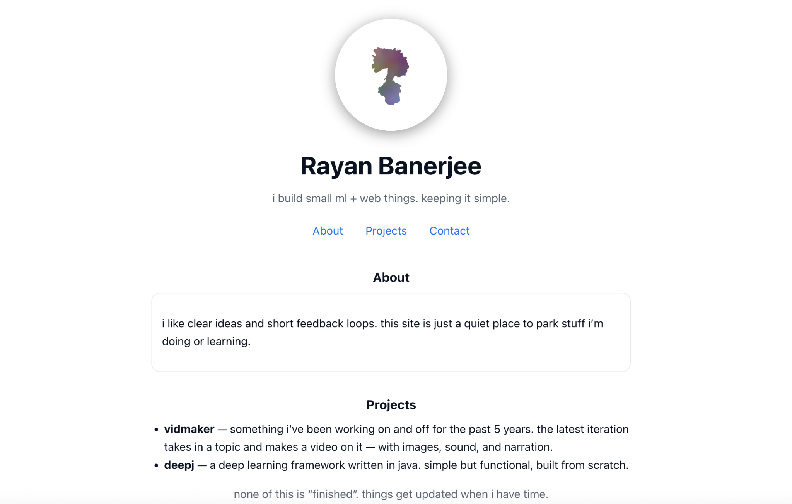

# Personal Website — Rayan Banerjee

## Access Method
**External:**  
Hosted via GitHub Pages:  
 [https://rayanbanerjee.github.io](https://rayanbanerjee.github.io)

---

## Site Overview & Audience
This is a simple, single-page personal website meant to serve as a quiet, minimal space to share what I’m working on — mostly small machine learning and web projects.  
The tone is casual and non-promotional. The audience includes classmates, instructors, and anyone curious about my projects.

The site uses **pure HTML + CSS + JS** with a responsive single-column layout and light/dark theme support via system preferences.

---

## Site Map
**Single-page site** with smooth in-page navigation:

1. **About** — short intro about me and what this site is for.  
2. **Projects** — overview of two current long-term projects:
   - **Vidmaker:** an AI-based video generation tool that takes a topic and produces a short narrated video with visuals and sound.
   - **DeepJ:** a deep learning framework written in Java, built from scratch for experimentation.
3. **Contact** — direct contact links (email, GitHub, Kaggle).

Navigation links (`About / Projects / Contact`) are available at the top and scroll smoothly to each section.

---

## Design Notes
- **Theme:** clean and neutral, focusing on readability and spacing.  
- **Colors:** derived from GitHub’s dark and light theme palette for familiarity and balance.  
- **Typography:** system default sans-serif stack (system-ui / Segoe UI / Roboto) for natural rendering.  
- **Layout:** single centered column (max-width 720px) for simplicity and focus.  
- **Visual hierarchy:** consistent header sizes and spacing.  
- **Media:** one abstract profile image centered at the top (acts as a visual anchor).  
- **Responsive:** layout scales naturally on both desktop and mobile.  
- **Tech stack:** pure HTML, CSS; no frameworks or external libraries.

---

## Screenshots
*(Sample image from rendered site)*

---

## Credits
- **Image:** flower silhouette with a noise mask multiplied with the object.  
- **Design & Code:** Rayan Banerjee (HTML/CSS/JS hand-written).  

---

## Optional Bonus
- Responsive layout works for both light and dark modes (CSS media query).  
- Smooth in-page navigation implemented with native browser scrolling.

